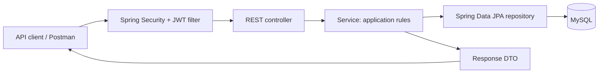
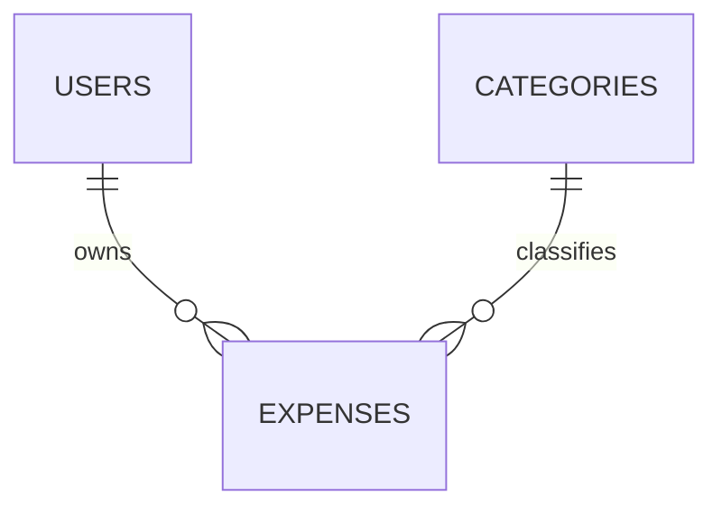

# Expense Management API — Project Documentation

**Implementation snapshot:** 7 October 2026  
**Project:** `expense-management-api`  
**Purpose:** A Java/Spring Boot REST backend for recording and managing expenses, categories, and user accounts.

This document combines the **Expense API Roadmap** conversation with the local project implementation. It was updated after implementing expense ownership, consistent request/authentication errors, one-sided date filters, and isolated integration tests. It lives at the project root beside `pom.xml`.

**Status terminology:** “Implemented” means the behavior exists in source. Test evidence is recorded separately in section 14. “Partial” identifies unfinished work; “planned” identifies work discussed but not implemented. Automated tests use an isolated H2 database; the live MySQL database has not been inspected or modified by this implementation work.

**Current milestone:** Core expense/category operations, JWT authentication, and per-user expense ownership are implemented. Creation assigns the authenticated user; listing, totals, reading, updating, and deleting are restricted to that owner. The first automated integration suite has been added. Category permissions, MySQL-specific verification, secret externalization, API documentation, and release tooling remain outstanding.

## Contents

1. [Project purpose and scope](#1-project-purpose-and-scope)
2. [Completed, partial, and planned functionality](#2-completed-partial-and-planned-functionality)
3. [Technology stack](#3-technology-stack)
4. [Architecture and request flow](#4-architecture-and-request-flow)
5. [Project structure](#5-project-structure)
6. [Data model and persistence](#6-data-model-and-persistence)
7. [DTOs and validation](#7-dtos-and-validation)
8. [REST API reference](#8-rest-api-reference)
9. [Filtering, sorting, and pagination](#9-filtering-sorting-and-pagination)
10. [Authentication and authorization](#10-authentication-and-authorization)
11. [Exception handling](#11-exception-handling)
12. [Local setup and configuration](#12-local-setup-and-configuration)
13. [Manual API walkthrough](#13-manual-api-walkthrough)
14. [Testing status and test plan](#14-testing-status-and-test-plan)
15. [Known limitations and unfinished work](#15-known-limitations-and-unfinished-work)
16. [Remaining roadmap](#16-remaining-roadmap)
17. [Maintaining this document](#17-maintaining-this-document)

## 1. Project purpose and scope

The project develops practical backend engineering skills through a personal expense-management domain. It supports user registration and login, expense CRUD, reusable categories, and searching/filtering a paginated expense collection.

The main learning areas are:

- Layered Spring Boot application design: controller → service → repository → database.
- REST endpoints, JSON DTOs, request validation, and exception handling.
- JPA entities, relational associations, and MySQL persistence.
- Dynamic queries with JPA Specifications, pagination, and sorting.
- BCrypt password hashing and JWT-based authentication.
- Record-level authorization for all expense operations.
- Automated integration testing, followed by API documentation and deployment.

“Personal Finance Management REST API” was suggested as a descriptive portfolio title. The actual artifact/application name remains `expense-management-api`. Income, budgets, and analytics are future extensions, so that broader title must not imply they already exist.

This is currently a backend project. No frontend is present in the inspected source. The Collaborative Project Tracker and Trade Processing & Settlement System discussed in the conversation are separate projects. Their PostgreSQL, session authentication, collaboration, locking, Redis, SOAP, and trade-processing designs are not part of this API's implementation.

## 2. Completed, partial, and planned functionality

| Area | Status | Evidence and boundary |
| --- | --- | --- |
| Spring Boot application and layered structure | Implemented | Application entry point, controllers, services, repositories, DTOs, and entities exist. |
| MySQL/JPA persistence | Implemented in configuration and code | Runtime connection and live schema were not verified. |
| Expense create/read/update/delete | Implemented | All five operations enforce authenticated ownership. |
| Category create/read/update/delete | Implemented | Shared categories; duplicate-name checks and an in-use deletion guard exist. |
| Expense/category relationship | Implemented | Each expense references a required category. |
| Expense/user relationship | Implemented | Creation derives the owner from authentication; queries and mutations enforce that owner. |
| Request and response DTOs | Implemented | Public responses avoid returning entity graphs or user passwords. |
| Bean Validation | Implemented | Validation failures now explicitly return HTTP 400 and field errors. |
| Global exception handling | Implemented for documented cases | Domain, validation, malformed JSON/parameter, and authentication errors use the common DTO. Database integrity failures still need dedicated handling. |
| Pagination and sorting | Implemented | Zero-based pages, bounded page size, allowed sort fields. |
| Dynamic filtering and text search | Implemented | Category name, independent inclusive date bounds, amount bounds, title/description search, always combined with ownership. |
| User registration/login | Implemented | Email normalization, duplicate checking, BCrypt, and token response. |
| JWT request authentication | Implemented | Stateless security filter and authenticated route rules. |
| Per-user expense isolation | **Implemented** | Owner-scoped list/totals and ID lookups; foreign and nonexistent IDs both return 404. |
| Automated feature/security tests | **Initial suite implemented** | Real Spring Security, controllers, services, and JPA run against isolated H2 test data; MySQL/concurrency coverage remains planned. |
| Swagger/OpenAPI | **Planned** | No supporting dependency or configuration found. |
| Docker | **Planned** | No Dockerfile or Compose configuration found. |
| GitHub Actions CI/CD | **Planned** | No workflow configuration found. |
| Deployment | **Planned** | No deployment or live endpoint verified. |
| Versioned database migrations | Discussed future work | Current configuration uses Hibernate `ddl-auto=update`; no Flyway/Liquibase setup found. |
| Income, budgets, analytics | Later extensions | No corresponding entities, endpoints, or services found. |

Test execution evidence is recorded in section 14. No coverage percentage, performance, production-readiness, or successful-deployment claim is made.

## 3. Technology stack

Versions below are taken from the project files, not recommendations to upgrade.

| Component | Inspected configuration | Role |
| --- | --- | --- |
| Java | `21` in `pom.xml` | Application language/build target. |
| Spring Boot | `4.1.1` parent | Application configuration and dependency management. |
| Spring Web MVC | `spring-boot-starter-webmvc` | REST controllers and JSON HTTP handling. |
| Spring Data JPA / Hibernate | `spring-boot-starter-data-jpa` | Repositories, ORM, and Specifications. |
| MySQL | Connector dependency; server version unspecified | Relational database. |
| Jakarta Bean Validation | `spring-boot-starter-validation` | Request constraints. |
| Spring Security | `spring-boot-starter-security` | Request authentication and password encoding. |
| JJWT | `0.12.7` (`api`, `impl`, `jackson`) | JWT signing and parsing. |
| Lombok | Version managed through the build | Generated accessors, constructors, and builders where used. |
| Maven Wrapper | Maven distribution `3.9.16`; wrapper `3.3.4` | Build and run commands. |
| Spring Boot test dependencies | JPA, validation, and Web MVC test starters | Application-context and API integration tests. |
| H2 | Test-scope dependency, version managed by Spring Boot | Isolated in-memory database in MySQL compatibility mode; not a replacement for MySQL-specific tests. |

The build coordinates are `com.example:expense-management-api:0.0.1-SNAPSHOT`. Dependency versions not explicitly shown above are managed by the Maven build.

## 4. Architecture and request flow



| Layer | Responsibility | Examples |
| --- | --- | --- |
| Controller | Routes, request parameters, `@Valid`, HTTP success status | `ExpenseController`, `CategoryController`, `AuthController` |
| Service | Business rules, entity lookup, mapping DTOs, coordinating persistence | `ExpenseService`, `CategoryService`, `UserService` |
| Repository | Database access and derived queries | `ExpenseRepository`, `CategoryRepository`, `UserRepository` |
| Entity | Persistent domain state and relationships | `Expense`, `Category`, `User` |
| DTO | API input/output contracts | `ExpenseRequest`, `ExpenseResponse`, `PagedResponse<T>` |
| Specification | Composable query predicates | `ExpenseSpecification` |
| Security | Token handling, user loading, authenticated identity | `JwtService`, `JwtAuthenticationFilter`, `CustomUserDetailsService`, `SecurityUtils` |
| Exception handling | Convert selected exceptions into API error objects | `GlobalExceptionHandler`, `ErrorResponse` |

### Creating an expense

1. The JWT filter authenticates a request carrying a valid bearer token.
2. The controller validates `ExpenseRequest`.
3. The service obtains the current email from the security context and loads the user.
4. It looks up the supplied `categoryId`; a missing category produces a domain exception.
5. It maps the request to an `Expense` and assigns the current user as owner.
6. The repository saves it; `@PrePersist` sets `createdAt`.
7. The service returns `ExpenseResponse`, and the controller returns HTTP 201.

DTO mapping is performed directly in the services; no mapping framework is configured. `ExpenseService` uses read-only transactions by default and write transactions for create/update/delete. This keeps entity access and response mapping within the service transaction, including when Open EntityManager in View is disabled. Category/user services still lack explicit multi-step transaction boundaries; expense transactions do not by themselves solve category-deletion or duplicate-write races.

## 5. Project structure

The package root is `com.example.expense_management_api`.

```text
expense-management-api/
  pom.xml
  mvnw
  mvnw.cmd
  .mvn/wrapper/maven-wrapper.properties
  .gitignore
  HELP.md
  PROJECT_DOCUMENTATION.md                 This document, when copied here
  src/main/java/com/example/expense_management_api/
    ExpenseManagementApiApplication.java
    config/
      SecurityConfig.java
    controller/
      AuthController.java
      CategoryController.java
      ExpenseController.java
    dto/
      AuthResponse.java
      CategoryRequest.java
      CategoryResponse.java
      ErrorResponse.java
      ExpenseRequest.java
      ExpenseResponse.java
      LoginRequest.java
      PagedResponse.java
      RegisterRequest.java
      UserResponse.java
    entity/
      Category.java
      Expense.java
      User.java
    exception/
      CategoryNotFoundException.java
      DuplicateResourceException.java
      ExpenseNotFoundException.java
      GlobalExceptionHandler.java
      InvalidCredentialsException.java
      InvalidRequestException.java
    repository/
      CategoryRepository.java
      ExpenseRepository.java
      UserRepository.java
    security/
      CustomUserDetailsService.java
      JwtAuthenticationFilter.java
      JwtService.java
      SecurityUtils.java
      SecurityErrorHandler.java
    service/
      CategoryService.java
      ExpenseService.java
      UserService.java
    specification/
      ExpenseSpecification.java
  src/main/resources/
    application.properties
  src/test/java/com/example/expense_management_api/
    ExpenseManagementApiApplicationTests.java
    ExpenseApiIntegrationTests.java
  src/test/resources/
    application-test.properties
```

Generated `target/` and IDE output are not application source. The inspected folder has no Git repository metadata, so this snapshot is tied to an inspection date rather than a commit identifier.

## 6. Data model and persistence



These are logical relationships represented by the JPA mappings; the live database schema was not inspected. An expense has one required user and one required category. A user/category may be referenced by many expenses. The Java relationships are declared on `Expense`; reverse collections are not required for this model.

### User — table `users`

| Java field | Type | Mapping/behavior |
| --- | --- | --- |
| `id` | `Long` | Identity-generated primary key. |
| `name` | `String` | Non-null column; registration trims the value. |
| `email` | `String` | Non-null; normalized on registration/login; named unique constraint `uk_user_email`. |
| `password` | `String` | Non-null; stores a BCrypt hash. Excluded from public DTOs. |
| `createdAt` | `LocalDateTime` | Set with `LocalDateTime.now()` before first persistence. |

There is no persisted roles collection or account-status field. The security loader assigns the same `USER` authority to each loaded user.

### Category — table `categories`

| Java field | Type | Mapping/behavior |
| --- | --- | --- |
| `id` | `Long` | Identity-generated primary key. |
| `name` | `String` | Non-null; named unique constraint `uk_category_name`. |

Categories are currently **global/shared**. They have no user relationship. Any authenticated user reaches the same category routes, including create, rename, and delete.

The service trims names and checks duplicates case-insensitively. Updating a category to its own name is allowed; using another category's name is rejected. Deletion is rejected when `ExpenseRepository.existsByCategoryId(id)` finds an expense using it. A category rename changes the name subsequently returned for expenses referencing that category.

Application duplicate checks are case-insensitive; the database constraint's behavior also depends on the actual MySQL collation. Concurrent duplicate writes and concurrent category deletion/expense creation do not have a dedicated service-level concurrency strategy.

### Expense — table `expenses`

| Java field | Type | Mapping/behavior |
| --- | --- | --- |
| `id` | `Long` | Identity-generated primary key. |
| `title` | `String` | Required by the request DTO; stored as supplied. |
| `amount` | `BigDecimal` | Required and at least `0.01` in requests. |
| `description` | `String` | Optional. |
| `category` | `Category` | Lazy `@ManyToOne`; non-null `category_id` join column. |
| `expenseDate` | `LocalDate` | Required in requests. |
| `createdAt` | `LocalDateTime` | Set before first persistence; not an update timestamp. |
| `user` | `User` | Lazy `@ManyToOne`; non-null `user_id` join column. |

`BigDecimal` is used for monetary values. The code does not define a currency field, currency conversion, or an explicit decimal precision/scale policy. Request validation does not restrict amounts to exactly two decimal places. The entity also has no `updatedAt`, optimistic-locking `version`, or soft-delete field; deletion is a physical delete.

The mappings do not explicitly make every DTO-required expense scalar column non-null. API validation and database constraints are separate protections.

### Schema lifecycle and timestamps

- Database URL in local configuration: `jdbc:mysql://localhost:3306/expense_management`.
- Hibernate configuration: `spring.jpa.hibernate.ddl-auto=update`.
- No versioned migration scripts were found. Hibernate updates are the current learning-stage schema approach.
- User and expense creation timestamps use local `LocalDateTime`; they have no stored offset and are not explicitly UTC.
- Existing expense rows created before the required user relationship may require an explicit ownership backfill. Do not assume Hibernate can determine an owner for legacy data.

## 7. DTOs and validation

### Request contracts

| DTO | Fields and rules |
| --- | --- |
| `RegisterRequest` | `name`: nonblank, max 100 characters; `email`: nonblank, valid email; `password`: nonblank, min 8 characters. |
| `LoginRequest` | `email`: nonblank, valid email; `password`: nonblank. |
| `CategoryRequest` | `name`: nonblank, max 50 characters. |
| `ExpenseRequest` | `title`: nonblank; `amount`: non-null, minimum `0.01`; `description`: optional; `categoryId`: non-null; `expenseDate`: non-null. |

Bean Validation runs before service normalization. Name/email trimming does not guarantee that a request with surrounding whitespace passes its original validation constraints. Expense titles and descriptions are not trimmed in the expense service.

The expense request has no owner/user field. The create service derives ownership from authentication. Both create and update use the same request DTO: `PUT` requires all mandatory fields and is not a partial update. Omitting the optional description on update clears it.

No explicit title/description length constraints, positive-ID constraint, future-date restriction, password complexity policy, or request amount scale constraint are present in these DTOs. Those rules must not be advertised as implemented.

### Response contracts

| DTO | Fields |
| --- | --- |
| `UserResponse` | `id`, `name`, `email`, `createdAt` |
| `AuthResponse` | `token`, `user` (`UserResponse`) |
| `CategoryResponse` | `id`, `name` |
| `ExpenseResponse` | `id`, `title`, `amount`, `description`, `categoryId`, `categoryName`, `expenseDate`, `createdAt` |
| `PagedResponse<T>` | `content`, `page`, `size`, `totalElements`, `totalPages`, `last` |
| `ErrorResponse` | `status`, `message`, `errors`, `timestamp` |

Expense responses do not expose the owner ID or serialize the full related user/category entities. User responses never include the password hash.

## 8. REST API reference

Use JSON request bodies with `Content-Type: application/json`. For protected routes, send:

```http
Authorization: Bearer <token-from-login>
```

The route/status tables describe the source mappings. Example IDs, dates, timestamps, and tokens are illustrative, not recorded execution results. The default local base URL is `http://localhost:8080` when Spring Boot's port has not been overridden.

### Authentication

| Method | Path | Authentication | Request | Success |
| --- | --- | --- | --- | --- |
| POST | `/api/auth/register` | Public | `RegisterRequest` | 201, `UserResponse` |
| POST | `/api/auth/login` | Public | `LoginRequest` | 200, `AuthResponse` |

Registration example:

```json
{
  "name": "Demo User",
  "email": "demo@example.com",
  "password": "ExampleOnly123!"
}
```

Registration returns user details; it does not return a JWT. Log in separately:

```json
{
  "email": "demo@example.com",
  "password": "ExampleOnly123!"
}
```

Login response shape:

```json
{
  "token": "<signed-jwt>",
  "user": {
    "id": 1,
    "name": "Demo User",
    "email": "demo@example.com",
    "createdAt": "2026-10-07T10:00:00"
  }
}
```

Duplicate registration email produces a 409 domain error. Unknown email and incorrect password both produce 401 with `Invalid email or password`.

### Categories

All category routes require authentication and currently operate on the shared category collection.

| Method | Path | Request | Success |
| --- | --- | --- | --- |
| POST | `/api/categories` | `CategoryRequest` | **200**, `CategoryResponse` |
| GET | `/api/categories` | None | 200, array of `CategoryResponse` |
| GET | `/api/categories/{id}` | None | 200, `CategoryResponse` |
| PUT | `/api/categories/{id}` | `CategoryRequest` | 200, `CategoryResponse` |
| DELETE | `/api/categories/{id}` | None | 204, empty body |

Create/update body:

```json
{
  "name": "Food"
}
```

Single-category response:

```json
{
  "id": 1,
  "name": "Food"
}
```

Category creation currently lacks a 201 annotation and therefore uses the normal 200 success response. Category listing has no pagination or explicit ordering. Missing categories produce 404; duplicate names and deletion of a category still used by expenses produce 409.

### Expenses

All expense routes require authentication and enforce expense ownership. Another user's expense is treated as unavailable with the same 404 response pattern as a nonexistent ID.

| Method | Path | Request | Success |
| --- | --- | --- | --- |
| POST | `/api/expenses` | `ExpenseRequest` | 201, `ExpenseResponse` |
| GET | `/api/expenses` | Optional query parameters | 200, `PagedResponse<ExpenseResponse>` |
| GET | `/api/expenses/{id}` | None | 200, `ExpenseResponse` |
| PUT | `/api/expenses/{id}` | Complete `ExpenseRequest` | 200, `ExpenseResponse` |
| DELETE | `/api/expenses/{id}` | None | 204, empty body |

Create/update body; replace `categoryId` with a real category ID:

```json
{
  "title": "Lunch",
  "amount": 250.00,
  "description": "Lunch at the college canteen",
  "categoryId": 1,
  "expenseDate": "2026-10-07"
}
```

Expense response shape:

```json
{
  "id": 1,
  "title": "Lunch",
  "amount": 250.00,
  "description": "Lunch at the college canteen",
  "categoryId": 1,
  "categoryName": "Food",
  "expenseDate": "2026-10-07",
  "createdAt": "2026-10-07T10:05:00"
}
```

An unknown or inaccessible expense ID produces 404. An unknown category in a create/update request also produces 404. Updates preserve `createdAt` and the existing owner and require that the caller is that owner.

There are no implemented `PATCH`, income, budget, analytics, current-user profile, or application-managed refresh-token routes in the inspected controllers.

## 9. Filtering, sorting, and pagination

`GET /api/expenses` accepts:

| Parameter | Type/default | Current behavior |
| --- | --- | --- |
| `page` | Integer, default `0` | Zero-based; must be nonnegative. |
| `size` | Integer, default `10` | Allowed range: 1–100. |
| `sortBy` | String, default `expenseDate` | Allowed: `id`, `title`, `amount`, `expenseDate`, `createdAt`. Names are case-sensitive. |
| `direction` | String, default `desc` | `asc` or `desc`, case-insensitive. |
| `category` | Optional string | Exact category-name match, ignoring case; not a category-ID filter. |
| `startDate` | Optional ISO date | Inclusive lower bound; works independently; format `yyyy-MM-dd`. |
| `endDate` | Optional ISO date | Inclusive upper bound; works independently or with `startDate`. |
| `minAmount` | Optional decimal | Inclusive lower bound; must be nonnegative. |
| `maxAmount` | Optional decimal | Inclusive upper bound; must be nonnegative. |
| `search` | Optional string | Case-insensitive SQL `LIKE` search over title **or** description. |

Nonblank filters are joined using **AND**, except the two text-search fields, which are joined with **OR**. The service starts with `ownedByUser(currentUserId)` and adds optional predicates before calling `findAll(specification, pageable)`. Ownership cannot be removed or selected through query parameters.

```http
GET /api/expenses?page=0&size=10&sortBy=amount&direction=desc&category=Food&startDate=2026-10-01&endDate=2026-10-31&minAmount=100&maxAmount=1000&search=lunch
```

Current edge cases:

- Each supplied date bound is applied independently and inclusively.
- When both dates are present, `startDate > endDate` is rejected.
- `minAmount > maxAmount` is rejected when both are supplied.
- Blank category/search strings are ignored; nonblank values are not trimmed.
- `%` and `_` in search text are not escaped, so SQL `LIKE` wildcard semantics may apply.
- Sorting uses the chosen field alone; no secondary ID tie-breaker is added.
- The list and its totals cover only the current user's matching records.

Example page shape for one matching result:

```json
{
  "content": [
    {
      "id": 1,
      "title": "Lunch",
      "amount": 250.00,
      "description": "Lunch at the college canteen",
      "categoryId": 1,
      "categoryName": "Food",
      "expenseDate": "2026-10-07",
      "createdAt": "2026-10-07T10:05:00"
    }
  ],
  "page": 0,
  "size": 10,
  "totalElements": 1,
  "totalPages": 1,
  "last": true
}
```

## 10. Authentication and authorization

### Implemented registration/login flow

1. Registration validates input, trims the name, and trims/lowercases email.
2. A case-insensitive email existence check rejects a duplicate account.
3. `BCryptPasswordEncoder` hashes the password before storage.
4. Login loads the user by normalized email and uses the password encoder to compare the supplied password with the stored hash.
5. Successful login produces a signed JWT plus the public user response.

BCrypt is one-way password hashing, not reversible encryption. Passwords and hashes are excluded from API responses.

### JWT contents and processing

- JWT subject: the user's email.
- Additional claim: `userId`.
- Issued-at and expiration timestamps are included.
- Configured lifetime: `86400000` milliseconds, or 24 hours.
- `JwtService` derives an HMAC key from the configured secret's **UTF-8 bytes**. It does not Base64-decode the configuration string.
- The token is signed with that key and signed claims are verified when parsed. The code lets the JWT library choose an appropriate signing algorithm for the key; this document does not promise a fixed algorithm name.

```text
Authorization: Bearer <JWT>
          |
JwtAuthenticationFilter
          |
Verify signed claims and extract email
          |
CustomUserDetailsService loads the user
          |
Validate subject and expiry
          |
Set Authentication in SecurityContext
          |
Protected controller/service
```

The filter expects the exact prefix `Bearer `, including capitalization and the space. It loads user details from the database rather than relying only on the token's `userId` claim. `SecurityUtils` reads the authenticated name/email; expense creation then resolves the corresponding database user.

`SecurityConfig` makes `/api/auth/**` public and requires authentication for all other requests. Session creation is stateless; CSRF is explicitly disabled. The current code does not implement a browser session/cookie authentication flow or configure a browser CORS policy.

The filter catches JWT exceptions, illegal arguments, and a missing database user, clears authentication, and continues the chain. On protected routes, `SecurityErrorHandler` returns HTTP 401 with `ErrorResponse` and `Authentication required`. It also provides a common HTTP 403 response for access denial. Controller/service authentication failures use the same 401 shape. The existing `USER` authority does not currently create role-restricted routes.

### Ownership enforcement

| Operation | Current implementation | Response boundary |
| --- | --- | --- |
| Create | Assigns the authenticated user | Request-supplied owner IDs are not used. |
| List/filter/search | Combines ownership with every filter | Results and page totals exclude other users. |
| Read by ID | Uses `findByIdAndUserId` | Foreign and missing IDs both return 404. |
| Update | Uses the owner-scoped lookup inside a write transaction | Foreign records are not changed. |
| Delete | Uses the owner-scoped lookup inside a write transaction | Foreign records are not deleted. |

Authentication identifies the caller; ownership authorization decides which records that caller may access. The original unscoped list/read/update/delete methods have been replaced with explicit ownership enforcement.

`ExpenseRepository.findByIdAndUserId` and `ExpenseSpecification.ownedByUser` are implemented. Integration tests exercise two-user isolation, including totals and unsuccessful foreign writes. Existing database rows with missing or incorrect historical owners still require a separate data audit; no owner assignment is guessed from old data.

Categories require a separate explicit policy decision: retain shared categories with suitable write permissions, or make categories user-specific. Neither a per-user category model nor administrator-only category management exists today.

The fixed `USER` authority is not multi-role RBAC. Refresh tokens, token revocation, password recovery, email verification, and application-managed logout are not implemented features. Removing a token from a client alone does not revoke a previously issued token.

## 11. Exception handling

`GlobalExceptionHandler` is a `@RestControllerAdvice`. Its common DTO is:

```json
{
  "status": 404,
  "message": "Expense not found with id: 123",
  "errors": null,
  "timestamp": "2026-10-07T10:10:00"
}
```

| Condition | Exception | Explicit HTTP mapping |
| --- | --- | --- |
| Expense ID missing | `ExpenseNotFoundException` | 404 |
| Category ID missing | `CategoryNotFoundException` | 404 |
| Invalid pagination/sort/filter combination | `InvalidRequestException` | 400 |
| Duplicate email/category, or category in use | `DuplicateResourceException` | 409 |
| Bad login credentials | `InvalidCredentialsException` | 401 |
| Request field validation failure | `MethodArgumentNotValidException` | 400, field-error map |
| Malformed JSON / incompatible parameter type | `HttpMessageNotReadableException` / `MethodArgumentTypeMismatchException` | 400, generic safe message |
| Missing/invalid/expired token or deleted user on a protected route | Security filter/entry point | 401, `Authentication required` |
| Access denied | Security access-denied handler | 403, `Access denied` |

Validation-body example:

```json
{
  "status": 400,
  "message": "Validation failed",
  "errors": {
    "title": "Title is required",
    "amount": "Amount must be greater than 0"
  },
  "timestamp": "2026-10-07T10:10:00"
}
```

The validation handler now explicitly sets HTTP 400. Integration tests check both transport status and the body. This repairs the original mismatch where the body contained 400 but the handler did not set the HTTP status.

The field-error map stores one message per field; multiple violations on the same field can overwrite each other. No ordering is promised. Timestamps use `LocalDateTime.now()` and carry no timezone offset.

Malformed JSON, incompatible request parameters, and the documented authentication failures now use the common DTO. Database integrity failures and other unhandled framework errors still need dedicated mappings. Invalid-token failures return `Authentication required`; bad credentials at login retain `Invalid email or password`.

## 12. Local setup and configuration

These instructions are derived from the project. Test execution is recorded in section 14; the application has not been started against the user's MySQL data during this work.

### Prerequisites

- A JDK matching the project's Java 21 setting.
- A running MySQL server and a database account permitted to use the project database.
- The project folder containing `pom.xml`, the Maven Wrapper scripts, and `src/`.
- Network access on the first build if Maven/dependencies are not cached.
- Postman or another HTTP client for manual requests.

A separate Maven installation is optional because the wrapper is present. MySQL's server version is not pinned by the repository.

### Database

Using a MySQL account permitted to create a local development database:

```sql
CREATE DATABASE IF NOT EXISTS expense_management;
```

The application account also needs the schema/data permissions required by the current Hibernate `update` configuration. No seeded users or categories were found; create these through the API.

### Configuration

| Property | Inspected setting or requirement |
| --- | --- |
| `spring.application.name` | `expense-management-api` |
| `spring.datasource.url` | `jdbc:mysql://localhost:3306/expense_management` |
| `spring.datasource.username` | A local MySQL username; configure for your machine. |
| `spring.datasource.password` | Your local database password; intentionally not reproduced here. |
| `spring.jpa.hibernate.ddl-auto` | `update` |
| `spring.jpa.show-sql` | `true` |
| `spring.jpa.properties.hibernate.format_sql` | `true` |
| `jwt.secret` | A secret suitable for HMAC signing; intentionally not reproduced here. |
| `jwt.expiration` | `86400000` milliseconds |
| `server.port` | Not set in the inspected file; normal default is 8080 unless overridden. |

The inspected properties file contains literal database-password and JWT-secret values. Move these to external configuration before sharing or deploying the project. If actual credentials have already been shared, replace them. This document contains no copy of those values.

For a local PowerShell session opened at the project root, environment overrides can be supplied as follows. Replace the angle-bracket placeholders locally:

```powershell
$env:SPRING_DATASOURCE_URL = 'jdbc:mysql://localhost:3306/expense_management'
$env:SPRING_DATASOURCE_USERNAME = '<your-local-db-user>'
$env:SPRING_DATASOURCE_PASSWORD = '<your-local-db-password>'
$env:JWT_SECRET = '<your-random-signing-secret>'
$env:JWT_EXPIRATION = '86400000'
```

Use a cryptographically random signing secret with at least 32 bytes of key material; do not use the placeholder or a memorable password. A local example that generates 64 random bytes and uses their Base64 text as the configuration value is:

```powershell
$expenseJwtBytes = New-Object byte[] 64
$expenseJwtRng = [System.Security.Cryptography.RandomNumberGenerator]::Create()
$expenseJwtRng.GetBytes($expenseJwtBytes)
$env:JWT_SECRET = [Convert]::ToBase64String($expenseJwtBytes)
$expenseJwtRng.Dispose()
```

This example does not print the secret. The application uses the resulting text's UTF-8 bytes; it does not decode it. Keep the same securely stored configuration value across restarts when existing tokens should continue to work. Generating a new key invalidates tokens signed with the previous key. Environment variables shown here last for the current process/session; no `.env` loader is configured in the source.

### Run, test, and package

From the project root on Windows:

```powershell
.\mvnw.cmd spring-boot:run
```

Then use `http://localhost:8080` if no port override applies. Stop the application with Ctrl+C. There is no custom health endpoint or Actuator dependency in the inspected project.

To run the current tests:

```powershell
.\mvnw.cmd test
```

Both test classes explicitly activate the `test` profile. `application-test.properties` selects an in-memory H2 database, `create-drop`, a test-only JWT key, and disabled Open EntityManager in View. The normal test command does not use the development MySQL configuration. Do not override test datasource properties with a real database URL.

To package and run the application:

```powershell
.\mvnw.cmd clean package
java -jar target/expense-management-api-0.0.1-SNAPSHOT.jar
```

Packaging runs tests by default. On macOS/Linux, use `./mvnw` in place of `.\mvnw.cmd` and provide equivalent environment configuration. Test evidence does not imply a verified MySQL startup or deployment.

### Troubleshooting

| Symptom | Check |
| --- | --- |
| Java compilation/version error | `java -version`, `JAVA_HOME`, and the Java 21 setting in `pom.xml`. |
| MySQL access denied/connection failure | Server availability, port 3306, account permissions, password, and database name. |
| JWT signing-key error | Ensure the configured secret has sufficient random key material and the override reached the application. |
| Protected request denied | Obtain a token from login and use the exact `Bearer ` prefix; check expiry and whether the signing key changed. |
| Expense creation fails for category | Create a category first and use the actual returned ID. |
| Category deletion returns conflict | Delete or reassign referencing development expenses before deleting the category. |
| Another user's expense returns 404 | Intentional ownership protection; log in as the expense owner. |
| Single date bound still appears ignored / validation returns 200 | Confirm the running process was rebuilt/restarted with the current changes. |

## 13. Manual API walkthrough

This is a repeatable Postman/client workflow, **not a record of tests already passed**. Use disposable local accounts and data.

Set a client variable `baseUrl` to `http://localhost:8080`. Save response IDs in separate `categoryId` and `expenseId` variables rather than assuming they are `1`. Keep bearer authentication with `tokenA` enabled for protected requests, except when a step explicitly tests missing/invalid authentication or switches to user B.

1. **Register user A:** `POST {{baseUrl}}/api/auth/register` using the registration example. Expected source mapping: 201 and a password-free user object.
2. **Log in user A:** `POST {{baseUrl}}/api/auth/login`. Save `token` as `tokenA`.
3. **Create a category:** `POST {{baseUrl}}/api/categories`, bearer token `{{tokenA}}`, body `{"name":"Food"}`. Current success mapping: 200. Save the returned category ID.
4. **Create an expense:** `POST {{baseUrl}}/api/expenses` with a full expense body and the saved category ID. Expected mapping: 201. Save its expense ID.
5. **Retrieve it:** `GET {{baseUrl}}/api/expenses/{{expenseId}}`. Compare the fields with the request.
6. **List and filter:** call `/api/expenses` using the query parameters in section 9. Check content and pagination metadata. Use multiple records to verify boundaries and sorting.
7. **Update it:** `PUT {{baseUrl}}/api/expenses/{{expenseId}}` with all required fields. Confirm `createdAt` is preserved and the changed values are returned.
8. **Check category rules:** creating another `food` should produce 409; deleting the category while the expense exists should produce 409.
9. **Check invalid requests:** try an empty title, amount below `0.01`, size `101`, reversed date bounds, and bad login credentials. Validation and malformed input should return HTTP 400; bad login credentials should return 401.
10. **Check authentication:** call protected routes without a token, with an invalid token, and with an expired token. Expect HTTP 401 and the common error body.
11. **Exercise ownership protection:** register/login user B. B's list and totals must exclude A's expenses. Direct read/update/delete of A's expense must return 404, with A's record unchanged.
12. **Clean up test data:** using the appropriate test account, delete the expense (204), confirm it is unavailable, then delete the unused category (204).

A category update/delete test affects the shared category collection, so use a uniquely named disposable category when existing local data is present. No exported Postman collection was found or created as part of this documentation task.

## 14. Testing status and test plan

The test sources are:

```text
src/test/java/com/example/expense_management_api/ExpenseManagementApiApplicationTests.java
src/test/java/com/example/expense_management_api/ExpenseApiIntegrationTests.java
```

The original `contextLoads()` smoke test remains. `ExpenseApiIntegrationTests` adds full Spring application integration tests using MockMvc, real JWT authentication, real services/repositories, and an in-memory H2 database. Both classes activate the `test` profile; Open EntityManager in View is disabled in that profile to check that expense mapping works within service transactions.

The initial suite covers authenticated owner assignment, owner-scoped pagination/totals, combined filters, foreign-ID read/update/delete denial, owner CRUD, inclusive single date bounds, request validation and malformed input, invalid query parameters, missing/invalid/expired/wrong-signature tokens, deleted users, registration/login/password hashing, category duplicates, and the in-use category deletion guard.

**Execution result:** Pending final test-run verification. This line will be updated after the run completes.

The broader test plan below includes additional cases beyond the initial suite; it is not a claim of exhaustive coverage:

| Area | Cases to cover | Useful level |
| --- | --- | --- |
| Registration/login | Valid registration, normalized duplicate email, BCrypt verification, wrong password, missing user, password absent from response | Service and API integration |
| JWT authentication | Valid token, missing token, malformed token, tampered signature, expiry, user no longer found | Security/API integration |
| Ownership | B cannot list/read/update/delete A's expenses; page totals cannot reveal A's data; create uses authenticated owner | Implemented two-user API/H2 integration |
| Expense CRUD | Persistence, missing IDs, valid category mapping, full update, deletion, preserved creation timestamp | Service and API integration |
| Category rules | Trimmed names, case-insensitive duplicates, self-name update, in-use deletion guard | Service and database integration |
| Validation/errors | Required fields, amount minimum, name limits, actual HTTP 400, error field map, malformed input | API/controller tests; initial coverage added |
| Filtering | Each predicate, combined filters, title/description OR, inclusive bounds, empty results, date-bound policy | Repository/API integration |
| Pagination/sorting | Page zero, negative page, size 0/101, allowed fields, invalid direction, totals, tied sort values | API/repository integration |
| Database integrity | Required references, uniqueness under concurrent writes, safe migration of existing ownership data | Real-MySQL integration |

MySQL-specific constraints/collation, concurrent writes, migrations, full validation boundaries, and broader category CRUD still require additional tests. H2's MySQL compatibility mode does not prove identical MySQL behavior. No coverage percentage or performance claim is established. A container-based MySQL test setup has not been implemented.

## 15. Known limitations and unfinished work

The original expense ownership gap, validation HTTP-status defect, missing standard authentication errors, and ignored single date bounds have been addressed. Remaining limitations are:

1. **Category permissions are broad.** Categories remain shared and mutable by any authenticated user. A deliberate shared/private permission model remains to be chosen.
2. **Configuration contains local secrets.** Externalize sensitive values before repository sharing/deployment; do not copy them into examples.
3. **Test coverage is not exhaustive.** Real MySQL behavior, concurrency, migrations, and additional validation/category cases remain to be covered.
4. **Historical ownership data is unverified.** Existing rows may require a reviewed data audit/backfill; no production/development data was automatically reassigned.
5. **Data policies need definition.** Currency, amount precision/scale, timestamp timezone, and input-length/database consistency are not fully specified.
6. **Schema evolution is not versioned.** Hibernate updates do not provide a reviewed migration history.
7. **Concurrency behavior is limited.** Expense transaction boundaries now exist, but no optimistic locking or explicit category-deletion/duplicate-write concurrency strategy exists.
8. **Not every error is standardized.** Database integrity violations and other unhandled framework failures still need explicit mapping.
9. **Search/sorting edge cases remain.** Search wildcards are not escaped and sorting has no secondary tie-breaker.
10. **API documentation and release tooling are pending.** OpenAPI, Docker, CI/CD, deployment configuration, and operational checks are not present.

These limitations make accurate documentation and targeted tests more useful than adding more financial features immediately.

## 16. Remaining roadmap

The latest conversation prioritizes finishing the existing project before starting another large project. Ownership enforcement and an initial test suite are now implemented; the original sequence is retained below for context:

```text
Finish user ownership
        ↓
Automated testing
        ↓
Swagger / OpenAPI
        ↓
Docker
        ↓
GitHub Actions CI/CD
        ↓
Deployment
        ↓
Income / budgets / analytics, if time permits
```

The completion checks below distinguish implemented portions from remaining work. They do not mark an entire milestone complete merely because its first portion exists.

| Milestone | Remaining work | Completion evidence |
| --- | --- | --- |
| 1. Ownership and API correctness | Owner-scoped expense operations, validation/authentication errors, and independent date bounds implemented. Category permissions, legacy ownership audit, and other integrity handling remain. | Two-user integration checks plus a reviewed category/data policy before shared use. |
| 2. Automated testing | Initial isolated H2 API/security suite implemented. Add real-MySQL, concurrency, and remaining boundary tests. | Repeatable passing tests; distinguish H2 coverage from MySQL verification. |
| 3. Swagger/OpenAPI | Add compatible OpenAPI tooling; document DTOs, bearer authentication, filters, actual status codes, and errors. | Generated documentation agrees with the implemented controllers and supports a complete API walkthrough. |
| 4. Docker | Add application build/runtime configuration and a reproducible local database setup. | A fresh environment can build and run using documented external configuration. |
| 5. GitHub Actions | Establish version control/remote as needed and a build/test workflow; add deployment automation only once the target is defined. | Changes trigger a reproducible build/test result; failures block release. |
| 6. Deployment | Select hosting, externalize secrets, define database migration/backup steps, configure HTTPS and operational logging. | A clean deployment completes an authenticated workflow and ownership tests; sensitive configuration is absent from source. |
| 7. Optional domain expansion | Design income, budgets, and analytics incrementally. | Each extension has explicit rules, owner-scoped data access, tests, and updated API documentation. |

Versioned database migrations were discussed as future work and should be addressed before repeatable shared deployments. Secret handling, category permissions, and remaining integrity issues belong in early correctness/release work, rather than being hidden by feature expansion.

There is no committed schedule or completion date for these milestones. The broader Project Tracker plan's sessions, PostgreSQL/Flyway, comments, activity logs, Redis, scheduling, and advanced concurrency are not automatically part of this roadmap.

## 17. Maintaining this document

Update this file alongside behavior changes. Move a feature from planned/partial to implemented only when the code exists; record runtime/test evidence separately. Keep examples, route statuses, and limitations aligned with the source.

Useful source references, relative to the repository root:

- [Build and dependency versions](pom.xml)
- [Expense API routes](src/main/java/com/example/expense_management_api/controller/ExpenseController.java)
- [Expense business rules and ownership enforcement](src/main/java/com/example/expense_management_api/service/ExpenseService.java)
- [Filtering predicates](src/main/java/com/example/expense_management_api/specification/ExpenseSpecification.java)
- [Category business rules](src/main/java/com/example/expense_management_api/service/CategoryService.java)
- [Registration and login](src/main/java/com/example/expense_management_api/service/UserService.java)
- [Security rules](src/main/java/com/example/expense_management_api/config/SecurityConfig.java)
- [JWT processing](src/main/java/com/example/expense_management_api/security/JwtService.java)
- [Exception mappings](src/main/java/com/example/expense_management_api/exception/GlobalExceptionHandler.java)
- [Application-context test](src/test/java/com/example/expense_management_api/ExpenseManagementApiApplicationTests.java)
- [API and security integration tests](src/test/java/com/example/expense_management_api/ExpenseApiIntegrationTests.java)
- [Isolated test configuration](src/test/resources/application-test.properties)

For roadmap provenance, the source conversation is **Expense API Roadmap**, with the latest priority update on 7 October 2026. Current implementation claims in this document were reconciled against the local source snapshot rather than inferred from earlier descriptions of intended features.
